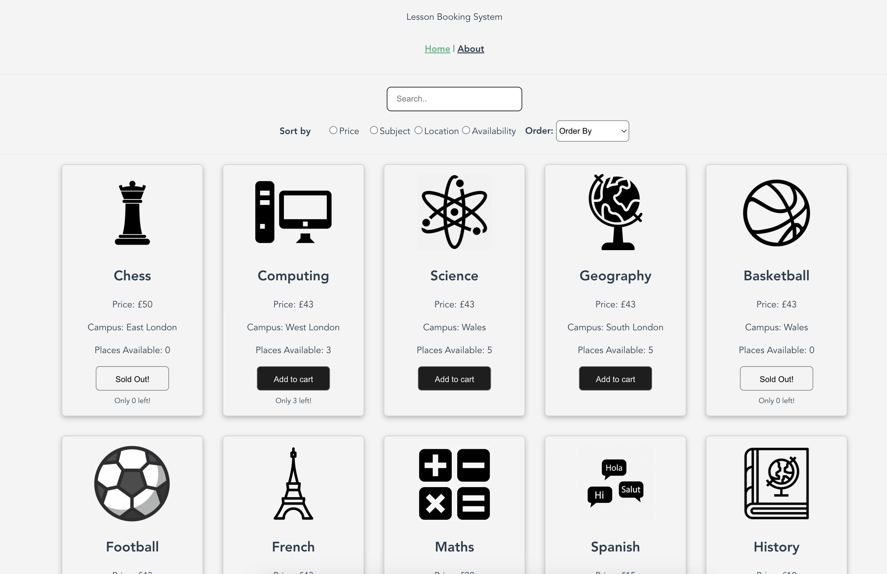
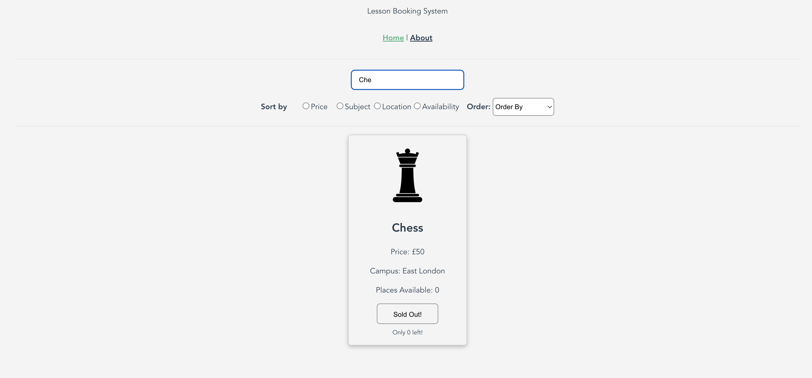
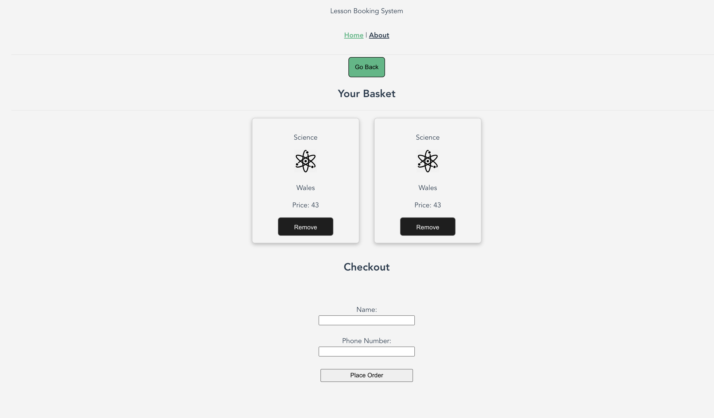
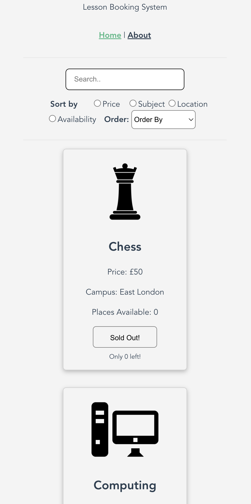
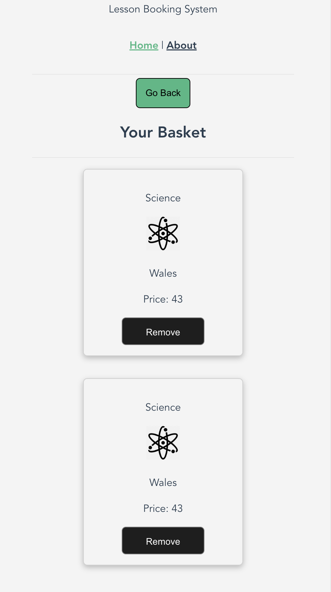

# lesson-booking-system

## Table of Contents

1. [Introduction](#introduction)
2. [Features](#features)
3. [Screenshots](#screenshots)
4. [Contributors](#contributors)

## Introduction 
Lesson Booking System is a web application designed to streamline the process of booking additional lessons offered by educational institutions.

## Features 

- Quick search using the search bar
- Add items to the cart and request additional lessons
- Responsive design

## Screenshots
- **Home Screen**:


- **Search Feature**:


- **Basket Page**:


- **Mobile First Design**:




## Project setup
```
npm install
```

### Compiles and hot-reloads for development
```
npm run serve
```

### Compiles and minifies for production
```
npm run build
```

### Lints and fixes files
```
npm run lint
```

## Contributors:
- Gurjeet Singh